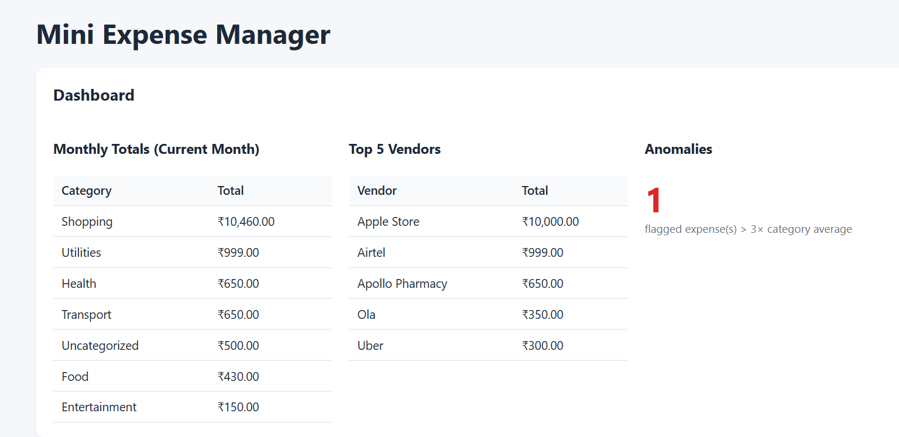
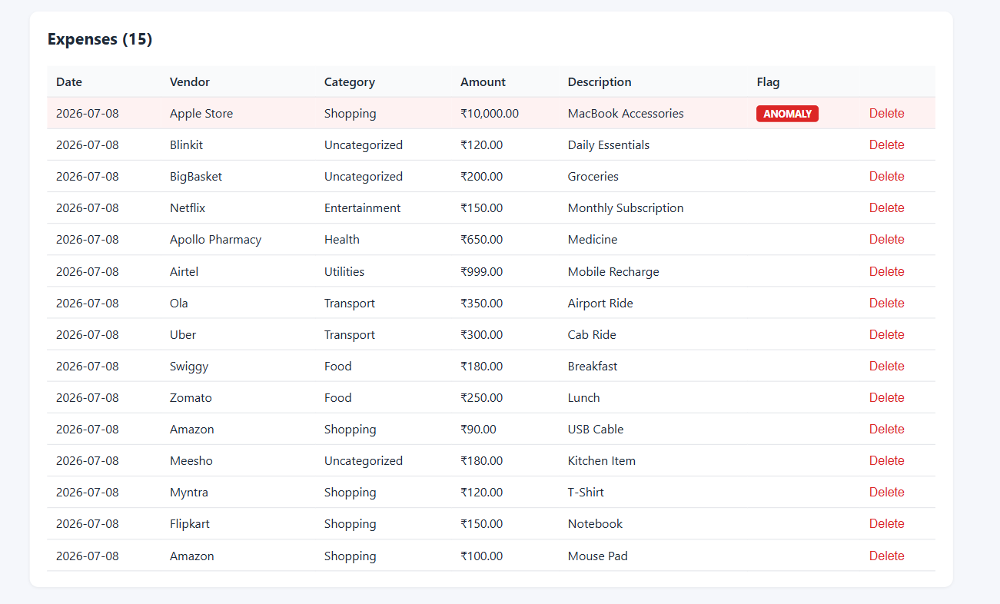
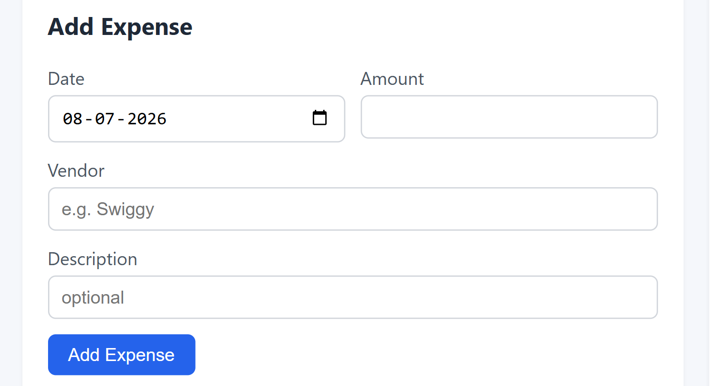
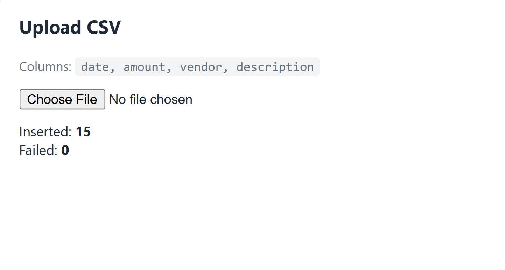

# Mini Expense Manager


A full-stack Expense Management application built using **React**, **Spring Boot**, and **PostgreSQL**. The application allows users to manage daily expenses with automatic vendor-based categorization, CSV import, anomaly detection, and an interactive analytics dashboard.

---

## 📸 Screenshots

### Dashboard



### Expense List



### Add Expense



### CSV Upload



---

# ✨ Features

- ✅ Add expenses manually
- ✅ Bulk CSV upload
- ✅ Automatic vendor-based categorization
- ✅ Dashboard analytics
- ✅ Monthly expense summary
- ✅ Top 5 vendors by spending
- ✅ Automatic anomaly detection
- ✅ Highlight anomalous expenses
- ✅ RESTful APIs
- ✅ PostgreSQL database support

---

# 🛠 Tech Stack

| Layer | Technology |
|--------|------------|
| Frontend | React 18, TypeScript, Vite, Axios |
| Backend | Java 17, Spring Boot 3 |
| Database | PostgreSQL |
| ORM | Spring Data JPA / Hibernate |
| Build Tool | Maven |

---

# 📂 Project Structure

```text
expense-manager/
│
├── backend/
│   ├── controller/
│   ├── dto/
│   ├── exception/
│   ├── model/
│   ├── repository/
│   ├── service/
│   └── resources/
│
├── frontend/
│   ├── src/
│   ├── components/
│   ├── services/
│   └── App.tsx
│
├── screenshots/
│   ├── dashboard.png
│   ├── expenses.png
│   ├── add-expense.png
│   └── csv-upload.png
│
├── sample-expenses.csv
├── docker-compose.yml
└── README.md
```

---

# ✨ Automatic Categorization

Expenses are automatically categorized based on vendor keywords.

| Vendor | Category |
|---------|----------|
| Swiggy | Food |
| Zomato | Food |
| Uber | Transport |
| Ola | Transport |
| Amazon | Shopping |
| Apple Store | Shopping |
| Myntra | Shopping |
| Netflix | Entertainment |
| Airtel | Utilities |
| Apollo Pharmacy | Health |

Vendor-category rules are stored in the database and can also be managed using REST APIs.

---

# 📄 CSV Upload

Upload expenses in bulk.

Supported CSV columns

```text
date,amount,vendor,description
```

Supported date formats

- yyyy-MM-dd
- dd/MM/yyyy
- MM/dd/yyyy
- dd-MM-yyyy

A sample CSV (`sample-expenses.csv`) is included in the project.

---

# 📊 Dashboard

The dashboard provides:

- Monthly expense totals by category
- Top 5 vendors by total spending
- Total anomaly count

---

# 🚨 Anomaly Detection

An expense is automatically flagged if its amount exceeds **3× the average amount of its category**.

Flagged expenses:

- Display a red **ANOMALY** badge
- Are counted in the dashboard
- Are highlighted in the expense table

---

# ⚙ Prerequisites

- Java 17+
- Maven 3.9+
- Node.js 18+
- npm
- PostgreSQL 14+

---

# ▶ Backend Setup

Move to backend

```bash
cd backend
```

Run the application

```bash
mvn spring-boot:run
```

Backend will start at

```
http://localhost:8080
```

---

# ▶ Frontend Setup

Move to frontend

```bash
cd frontend
```

Install dependencies

```bash
npm install
```

Run the development server

```bash
npm run dev
```

Frontend will be available at

```
http://localhost:5173
```

---

# 🗄 Database Configuration

Default PostgreSQL configuration

```yaml
spring:
  datasource:
    url: jdbc:postgresql://localhost:5432/expense_manager
    username: postgres
    password: postgres
```

Update the values in `application.yml` if using a different database.

---

# 📁 Sample CSV

Upload

```
sample-expenses.csv
```

The sample dataset contains multiple expense records, including a high-value **Apple Store** purchase that is automatically detected as an anomaly.

---

# 🌐 REST APIs

| Method | Endpoint | Description |
|---------|----------|-------------|
| GET | `/api/expenses` | Get all expenses |
| POST | `/api/expenses` | Add a new expense |
| DELETE | `/api/expenses/{id}` | Delete an expense |
| POST | `/api/expenses/upload` | Upload CSV |
| GET | `/api/expenses/dashboard` | Dashboard summary |
| GET | `/api/rules` | Get vendor-category rules |
| POST | `/api/rules` | Add vendor rule |
| DELETE | `/api/rules/{id}` | Delete vendor rule |

---

# 💡 Design Highlights

- Layered Architecture (Controller → Service → Repository)
- Spring Boot REST APIs
- Spring Data JPA & Hibernate
- PostgreSQL persistence
- Vendor keyword-based categorization
- OpenCSV parsing
- Bean Validation
- Global exception handling
- Automatic anomaly recomputation after inserts and CSV imports

---

# 📦 Build

### Frontend

```bash
cd frontend
npm run build
```

### Backend

```bash
cd backend
mvn clean package
```

Run the generated JAR

```bash
java -jar target/expense-manager-0.0.1-SNAPSHOT.jar
```

---

# 🔮 Future Improvements

- User Authentication & Authorization
- Expense Editing
- Expense Filtering & Search
- Monthly Charts & Reports
- Export to PDF / Excel
- Email Notifications
- Machine Learning-based Anomaly Detection

---

## 👨‍💻 Author

**Vishal Kumar**

Built as a Full-Stack Java + React assignment demonstrating CRUD operations, REST APIs, PostgreSQL integration, CSV processing, automatic categorization, and anomaly detection.